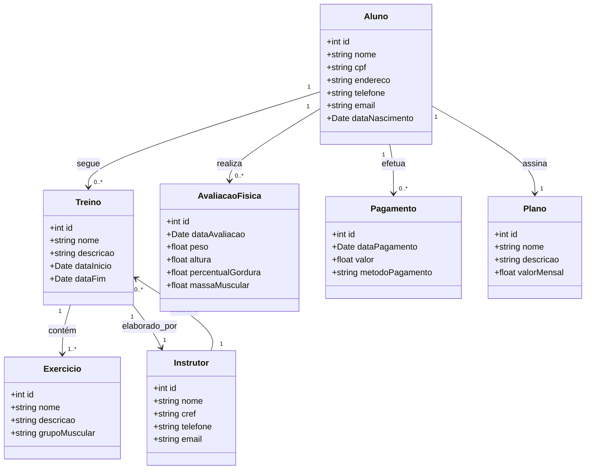

<h1 align="center">GymTrack</h1>

  <strong>🏋🏽 ⚙️ 🏃🏽</strong>

  GymTrack é uma plataforma inteligente de gestão para academias, oferecendo controle automatizado de fluxo de alunos, monitoramento de progresso físico e otimização da experiência dos usuários em tempo real!

## 🛠️ Pré-requisitos

N/A

## 🚀 Passo a passo interativo

n/a

## Links Úteis:

1.  [Figma Design](https://www.figma.com/design/P3UNY8tWPJj7FW43XrU9ZE/Untitled?node-id=0-1&t=b3ow5hTyewWG7oIH-1)

2.  [Jira Board](https://coderfullstackvinicius.atlassian.net/jira/software/projects/SCRUM/boards/1/backlog?atlOrigin=eyJpIjoiYjI0Yzc5YWNmNTJiNGIzYjhlYjg2YzJjMGEyZDdlNjYiLCJwIjoiaiJ9)

## Integrantes do Projeto:

- Vinícius S. Queiroz - [Link do LinkedIn](https://www.linkedin.com/in/viníciussilvaqueiroz/)
- Guilherme W. Nogueira - [Link do LinkedIn](https://www.linkedin.com/in/guilherme-wolf/)
- Arthur F. Campos - [Link do LinkedIn](https://www.linkedin.com/in/arthur-campos-a120472b7/)
- Dereck A. do E. Portela - [Link do LinkedIn](https://www.linkedin.com/in/dereck-portela-36682675/)
- Paulo R. de B. Mendes - [Link do LinkedIn](https://www.linkedin.com/in/paulo-mendes/)
- Pierre Costa S. de O. N. - [Link do LinkedIn](https://www.linkedin.com/in/pierre-costa-b1b51314a/)
- Ylson Santos - [Link do LinkedIn](https://www.linkedin.com/in/pierre-costa-b1b51314a/)

## Diagrama de Classes

